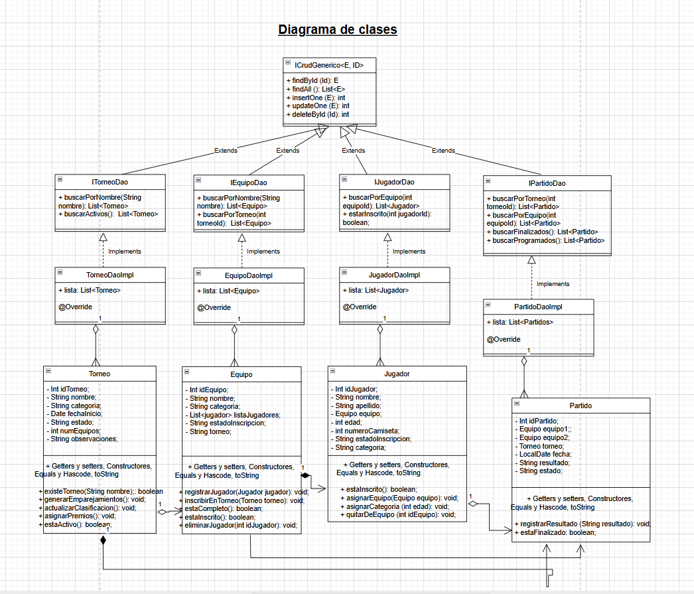

# Sistema de Gestión de Torneos deportivos
## Autor
Gustavo Mendoza camuñas
Mi perfil de GitHub: https://github.com/gusmenca1
## Descripción del Proyecto
Link al repositorio del proyecto: https://github.com/gusmenca1/torneo-esports-uml.git
 
Este proyecto implementa un sistema de gestión de torneos deportivos
utilizando UML para el modelado y Java para la implementación. La implementación en Java no se ha realizado, siguiendo las indicaciones del profesor.
## Diagramas UML
### Diagrama de Casos de Uso

### Diagrama de Clases

## Estructura del Proyecto
torneo-esports-uml/ ├── src/
├── diagrams/
│ ├── casos-uso.png
│ ├── clases.png
├── README.md
├── .gitignore

## Justificación del diseño

**✅ Justificación del diseño del sistema de gestión de competiciones deportivas**

**🎯 Objetivo del sistema:**

En primer lugar aclarar que me he permitido alejarme de la propuesta del enunciado y he dirigido el sistema hacia un diseño para gestionar competiciones deportivas, permitiendo el registro de equipos y jugadores, la creación de torneos, la inscripción de jugadores, la generación de partidos y la gestión de resultados.

**🧱 Organización general del modelo:**

El diseño se basa en principios de modelado orientado a objetos, usando clases que representan entidades reales del ámbito deportivo (Torneo, Equipo, Jugador y Partido) y aplicando un enfoque modular y escalable.

**🔍 Estructura de clases y relaciones:**

**1. Torneo:**
   
Representa las diferentes competiciones.

Tiene una relación de agregación con Equipo (un torneo puede tener varios equipos, pero no es imprescindible inscribir equipos para crear una competición).

Tiene una relación de composición con Partido (los partidos son generados dentro del torneo y no existen fuera de él).

Métodos como generarEmparejamientos() y asignarPremios() justifican esta lógica.

**2. Equipo:**
   
Clase que agrupa a los jugadores y participa en torneos.

Relación de agregación con Jugador: un equipo puede tener varios jugadores, y estos pueden existir fuera del equipo y ser cambiado a otro equipo, por ejemplo.

Tiene métodos propios como registrarJugador() y estaInscrito() para encapsular su comportamiento.

**3. Jugador:**

Representa a un participante en el torneo. Asociado directamente a un Equipo.

Incluye atributos como nombre, edad y métodos como estaInscrito() o asignarAEquipo().

**4. Partido:**

Representa el emparejamiento entre dos equipos dentro de un torneo.

Cada Partido tiene referencias a equipo1, equipo2 y al Torneo al que pertenece.

Contiene la lógica de resultado y estado (finalizado, pendiente, suspendido,...).

Podríamos haber considerado una relación de agregación entre Jugador y Partido, en caso de querer considerar información como alineaciones, estadísticas individuales, 
pero con la intención de no complicar más el modelo nohemos considerado esta relación.

**🧩 Modelo DAO:**

He utilizado el patrón DAO (Data Access Object) para separar la lógica de negocio de la lógica de acceso a datos:

Cada entidad (Torneo, Equipo, Jugador, Partido) tiene:

 - Una interfaz DAO (ITorneoDao, etc.)

 - Una clase de implementación (TorneoDaoImpl)

 - Todos extienden de una interfaz genérica ICrudGenerico<E, ID>, lo que permite reutilizar métodos estándar como insertOne, findById, delete, etc.

Este modelo mejora la mantenibilidad y escalabilidad del sistema.

**⚖️ Razones del diseño elegido:**

 - Claridad conceptual: cada clase representa una entidad real del dominio del problema.

 - Bajo acoplamiento y alta cohesión: los objetos están bien encapsulados y especializados en su función.

 - Escalabilidad: el diseño permite añadir nuevas funcionalidades como gestión de árbitros, fases de torneo, etc.

 - Facilidad de mantenimiento: la separación entre lógica de negocio y acceso a datos permite trabajar en capas.
   

**🛠️ Tecnologías y herramientas aplicadas:**

 - UML para el modelado de clases, casos de uso y relaciones.

 - Git y GitHub para control de versiones.
   

## Conclusiones

Este diseño proporciona una base sólida para la gestión integral de torneos deportivos. Su estructura orientada a objetos, combinada con un enfoque DAO y un modelado claro en UML, garantiza un sistema robusto, extensible y fácil de mantener.  
